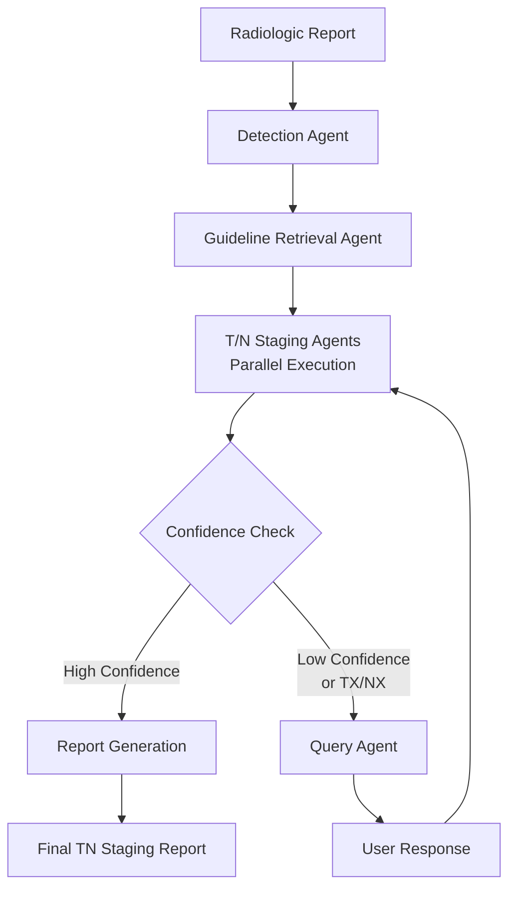

# TN Staging Agentic System

An automated TN staging analysis system for radiologic reports using a step-wise, LLM-first agentic approach with retrieved AJCC guidelines.

## 🎯 Overview

This system helps radiologists produce high-quality, standardized TN staging reports by:
- **Analyzing radiologic reports** using retrieved AJCC guidelines
- **Interactive workflow** that asks clarifying questions when needed
- **Step-wise processing** for reproducibility and transparency
- **Dual implementation** supporting both OpenAI (cloud) and Ollama (local)

## 🏗️ Architecture

### LLM-First Approach
```
Raw Report + Retrieved Guidelines → LLM Analysis → Structured JSON Output
```

**Key Principle**: No hardcoded medical rules - all staging logic through LLM + guidelines

### Core Workflow


### Agents
1. **Detection Agent** - Identifies body part and cancer type from report
2. **Guideline Retrieval Agent** - Fetches relevant AJCC criteria from vector store
3. **T/N Staging Agents** - Direct LLM analysis with structured JSON output
4. **Query Agent** - Generates targeted questions when confidence is low
5. **Report Agent** - Produces final comprehensive staging report

## 🚀 Quick Start

### Prerequisites
- Python 3.10+ (recommended: use conda environment)
- Ollama (for local LLM) or OpenAI API key (for cloud LLM)

### Installation

1. **Clone and setup environment:**
```bash
git clone https://github.com/znee/tn_staging_agentic.git
cd tn_staging_agentic

# Use conda environment (recommended)
conda env create -f environment.yml
conda activate tnm-staging
```

2. **Setup Ollama (for local LLM):**
```bash
# Install Ollama: https://ollama.ai
ollama pull qwen3:8b
ollama pull nomic-embed-text:latest
ollama serve
```

3. **Setup OpenAI (for cloud LLM):**
```bash
export OPENAI_API_KEY="your-api-key-here"
```

4. **Build vector stores (required for first use):**
```bash
# For Ollama version
streamlit run not_using/ajcc_tokenizer_ollama.py

# For OpenAI version  
streamlit run not_using/ajcc_tokenizer_openai.py
```

## 📖 Usage

### Command Line Interface
```bash
# Analyze a report with Ollama
python tn_staging_api.py --backend ollama --report "Your radiologic report text here"

# Analyze with OpenAI
python tn_staging_api.py --backend openai --report "Your radiologic report text here"

# Check backend status
python tn_staging_api.py --status --backend ollama

# Get JSON output
python tn_staging_api.py --json --backend ollama --report "report text"
```

### Streamlit GUI
```bash
# Launch interactive web interface
streamlit run tn_staging_gui.py --server.port 8501
```

The GUI provides:
- **Chat-like interface** showing analysis history
- **Interactive queries** when additional information is needed
- **Detailed results** with staging rationale and confidence scores
- **Real-time processing** with progress indicators

### Example Usage

**Input Report:**
```
Clinical information: Oral cavity, base of tongue, left, biopsy.
About 5.4 x 3.0 x 2.7 cm sized irregular ulcerative mass centered at 
Lt base of tongue with extension to left lingual surface and 
glossoepiglottic fold.
```

**Initial Analysis Result:**
```json
{
  "success": true,
  "query_needed": true,
  "query_question": "Are there any enlarged or suspicious lymph nodes visible on the radiologic imaging? If yes, please specify the number, size (in cm), and anatomical location.",
  "t_stage": "T4",
  "n_stage": "NX",
  "t_confidence": 0.95,
  "n_confidence": 0.9,
  "t_rationale": "Based on AJCC guidelines: T4 is defined as cancer that has grown into the larynx, tongue muscle, or bones. The report indicates extension to the glossoepiglottic fold.",
  "n_rationale": "Based on AJCC guidelines: No lymph node information in report",
  "backend": "ollama"
}
```

**User Response:**
```
"Multiple enlarged lymph nodes in cervical levels II-IV, largest 2.8cm"
```

**Final Analysis Result:**
```json
{
  "success": true,
  "tn_stage": "T4N3a",
  "t_stage": "T4",
  "n_stage": "N3a", 
  "t_confidence": 0.95,
  "n_confidence": 0.90,
  "t_rationale": "Based on AJCC guidelines: T4 criteria met with extension to glossoepiglottic fold",
  "n_rationale": "Based on AJCC guidelines: Multiple ipsilateral nodes <6cm meets N3a criteria",
  "backend": "ollama",
  "duration": 145.2
}
```

## 🛠️ Configuration

### Backend Options
- **`ollama`** - Local LLM (private, no API costs)
- **`openai`** - Cloud LLM (requires API key, faster)
- **`hybrid`** - Ollama for generation, OpenAI for embeddings

### Environment Variables
```bash
# OpenAI (optional)
export OPENAI_API_KEY="your-key"

# Ollama (optional - uses defaults)
export OLLAMA_BASE_URL="http://localhost:11434"

# Backend selection (optional)
export TN_STAGING_BACKEND="ollama"
```

## 📁 Project Structure

```
tn_staging_agentic/
├── README.md                    # This file
├── CLAUDE.md                    # Project specifications
├── ARCHITECTURE.md              # Detailed architecture documentation
├── requirements.txt             # Python dependencies
├── environment.yml              # Conda environment
├── tn_staging_api.py           # Command-line interface
├── tn_staging_gui.py           # Streamlit web interface  
├── main.py                     # Core system
├── agents/                     # LLM agents
│   ├── detect.py              # Body part/cancer detection
│   ├── retrieve_guideline.py  # AJCC guideline retrieval
│   ├── staging_t.py           # T staging analysis
│   ├── staging_n.py           # N staging analysis
│   ├── query.py               # Interactive questioning
│   └── report.py              # Final report generation
├── config/                     # LLM provider configurations
├── contexts/                   # Context and workflow management
├── utils/                      # Logging and utilities
├── guidelines/                 # AJCC PDF guidelines
├── faiss_stores/              # Vector databases (built locally)
├── logs/                      # Session logs (gitignored)
├── old/                       # Previous version (reference)
└── not_using/                 # Archived files and utilities
```

## 🔬 Key Features

### LLM-First Architecture
- **No hardcoded medical rules** - all staging logic through LLM + retrieved AJCC guidelines
- **Direct report analysis** - no intermediate pattern extraction
- **Structured JSON output** with staging, confidence, rationale, and extracted info
- **Guidelines-based reasoning** - always references retrieved AJCC criteria
- **Enhanced JSON parsing** - robust handling of LLM responses with `<think>` tags

### Interactive Workflow  
- **Confidence assessment** - pauses when staging is uncertain (T/N confidence < 0.7 or TX/NX results)
- **Radiologic-focused questions** - asks specific questions about imaging findings
- **Enhanced report re-analysis** - combines user responses with original reports
- **Transparent reasoning** - shows rationale citing specific guideline criteria
- **Real-time chat interface** - conversational UI with query handling

### Medical Accuracy
- **Proper N0 vs NX distinction** - N0 only with explicit negative findings, NX when unclear
- **Radiologic context awareness** - questions focus on imaging findings, not pathology
- **AJCC guideline compliance** - vector store retrieval of official staging criteria
- **Confidence-based validation** - automatic query generation for uncertain staging

### Production Ready
- **Session logging** - Detailed logs for debugging and auditing
- **Error handling** - Graceful fallbacks and clear error messages
- **Testing suite** - Comprehensive tests for reliability
- **Clean architecture** - Simplified, maintainable codebase
- **Streamlit GUI** - User-friendly web interface with chat history

## 🧪 Testing

```bash
# Test API functionality
python tn_staging_api.py --status --backend ollama

# Test with sample report
python tn_staging_api.py --backend ollama --report "5cm tongue mass with metastatic nodes"

# Run system validation
python not_using/validate_system.py
```

## 📊 Performance

- **Analysis time**: 1-3 minutes per report (depends on LLM backend)
- **Accuracy**: High accuracy with retrieved AJCC guidelines
- **Memory usage**: ~2GB RAM (includes vector stores)
- **Models**: qwen3:8b recommended for medical accuracy

## 🔧 Troubleshooting

### Common Issues

**Vector store not found:**
```bash
# Rebuild vector stores
streamlit run not_using/ajcc_tokenizer_ollama.py
```

**Ollama connection error:**
```bash
# Check Ollama is running
ollama list
ollama serve  # if not running
```

**OpenAI API errors:**
```bash
# Verify API key
echo $OPENAI_API_KEY
```

**GUI not loading:**
```bash
# Use different port
streamlit run tn_staging_gui.py --server.port 8502
```

### Logs
- **Session logs**: `logs/session_<id>_<date>.log`
- **Debug mode**: Add `--debug` flag for verbose output
- **GUI logs**: Check browser console for frontend issues

## 🤝 Contributing

1. Follow the LLM-first architecture principles
2. No hardcoded medical rules - use retrieved guidelines
3. Add tests for new functionality  
4. Update documentation for changes
5. Use the conda environment for consistency

## 📄 License

MIT License - see [LICENSE](LICENSE) file for details.

## 🤝 Contributing

We welcome contributions! Please see our [Contributing Guidelines](CONTRIBUTING.md) for details.

### Development Setup
1. Fork the repository
2. Create a feature branch: `git checkout -b feature/amazing-feature`
3. Install dependencies: `conda env create -f environment.yml`
4. Make changes and add tests
5. Submit a pull request

### Code Style
- Follow existing code patterns and structure
- Add docstrings for new functions and classes
- Include type hints where applicable
- Update documentation for new features

## 🐛 Issues & Support

- **Bug Reports**: Please use GitHub Issues with the bug template
- **Feature Requests**: Use GitHub Issues with the feature request template
- **Questions**: Use GitHub Discussions for general questions

## 📊 Project Status

- **Version**: 2.0.0 (Production Ready)
- **Stability**: Stable
- **Maintenance**: Actively maintained
- **Testing**: Comprehensive test coverage
- **Documentation**: Complete

## 📚 Documentation

- **CLAUDE.md** - Complete project specifications and requirements
- **ARCHITECTURE.md** - Detailed architecture documentation with diagrams
- **not_using/docs/** - Additional documentation and troubleshooting guides

## 🔗 References

- **AJCC Cancer Staging Manual** (8th Edition)
- **Ollama**: https://ollama.ai
- **OpenAI API**: https://platform.openai.com
- **Streamlit**: https://streamlit.io

---

**⚠️ Medical Disclaimer**: This system assists clinical decision-making and should not replace professional medical judgment. All staging results must be validated by qualified healthcare professionals.

**Status**: ✅ Production Ready - Clean LLM-first architecture with comprehensive testing and documentation.