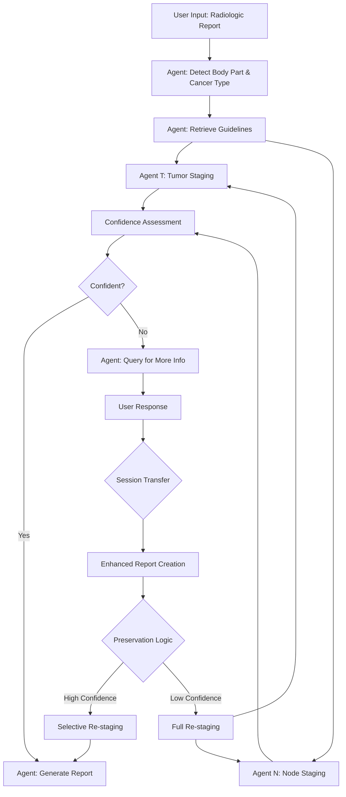

# Radiologic TN Staging System

**GitHub Repository**: https://github.com/znee/tn_staging_agentic  
**Current Version**: v2.0.3 (Production Ready)

## Project Overview

An automated TN staging analysis system for radiologic reports using LLM-first agentic approach with retrieved AJCC guidelines.

### Core Capabilities (v2.0.3)
- **Enhanced semantic retrieval** with case characteristic extraction (9x content improvement)
- **Multi-cancer architecture** with body part-specific vector stores and intelligent routing
- **Smart Q&A workflow** with session continuity and selective preservation
- **Production-ready system** with comprehensive error handling and logging

## System Architecture

### Core Workflow



### Agent Descriptions

1. **`agent_detect`**
   - Input: `context_R` (radiologic report)
   - Output: `context_B` (body part and cancer type)
   - Purpose: Identifies the anatomical location and cancer type from the report

2. **`agent_retrieve_guideline`**
   - Input: `context_B`
   - Output: `context_GT` (T staging guidelines), `context_GN` (N staging guidelines)
   - Purpose: Retrieves relevant staging criteria from tokenized PDF guidelines
   - Note: Must handle various staging systems (e.g., T1-T4 vs T1-T4a/b)

3. **`agent_T`** and **`agent_N`** (Parallel execution)
   - Input: `context_R` (raw report), `context_B` (body part/cancer type), `context_GT`/`context_GN` (guidelines)
   - Output: `context_T`/`context_N` (staging results), `context_CT`/`context_CN` (confidence), `context_RationaleT`/`context_RationaleN` (rationale)
   - Purpose: **Directly analyze raw report with guidelines** to determine staging
   - Method: **LLM-based analysis with structured JSON output** including extracted information
   - Fallback: Returns TX/NX if staging cannot be determined

4. **`agent_query`**
   - Input: All contexts when confidence is low or output from `agent_T` or `agent_N` are TX/NX
   - Output: `context_Q` (specific questions for user)
   - Purpose: Generates targeted questions to obtain missing information

5. **`agent_report`**
   - Input: All available contexts
   - Output: Formal radiologic report with comprehensive staging
   - Purpose: Produces the final structured report

## Session Transfer Optimization

### Overview
When users provide additional information in response to queries, the system uses **session transfer** instead of session continuation to avoid asyncio event loop issues while preserving analytical context.

### Session Transfer Process

1. **Context Extraction**: Extract all contexts from previous analysis
2. **Enhanced Report Creation**: Append user response to original report
3. **Preservation Logic**: Determine which staging results to preserve
4. **Selective Analysis**: Run only necessary staging agents
5. **Result Integration**: Combine preserved and new results

### Preservation Logic

**High-Confidence Preservation** (confidence ≥ 70% AND stage ≠ TX/NX):
- **Both T & N preserved**: Minimal re-analysis (report generation only)
- **T preserved, N re-analyzed**: Skip T staging, re-run N staging
- **N preserved, T re-analyzed**: Skip N staging, re-run T staging
- **Neither preserved**: Full re-analysis of both staging agents

### Benefits

- ✅ **Reliability**: Avoids event loop closure issues
- ✅ **Performance**: Skips redundant high-confidence staging
- ✅ **Context Preservation**: Maintains analytical continuity
- ✅ **Transparency**: Clear logging of preservation decisions

## Implementation Details

### Context Variables
- `context_R`: Original radiologic report
- `context_B`: Body part and cancer type information
- `context_GT`: T staging guidelines
- `context_GN`: N staging guidelines
- `context_T`: T staging result
- `context_N`: N staging result
- `context_CT`: Confidence level of T staging
- `context_CN`: Confidence level of N staging
- `context_RationaleT`: Reasoning for T staging decisions
- `context_RationaleN`: Reasoning for N staging decisions
- `context_Q`: Query for additional information
- `context_RR`: User response to query

### Key Development Principles

1. **LLM-First Architecture**
   - **No hardcoded medical rules** - all staging logic through LLM + guidelines
   - **Direct report analysis** - no intermediate pattern extraction layer
   - **Structured JSON output** with staging, confidence, rationale, and extracted info
   - **Guidelines-based reasoning** - always reference retrieved AJCC criteria

2. **Error Handling**
   - Handle incomplete or ambiguous reports gracefully
   - Fallback to TX/NX when LLM analysis fails (not when medical criteria unclear)
   - Robust JSON parsing with text extraction fallbacks
   - Clear error messages for debugging

3. **Testing Strategy**
   - Unit tests for each agent with various report formats
   - Integration tests for the full workflow including query handling
   - Test cases for edge cases (missing information, ambiguous descriptions)
   - Validation of JSON output format consistency

4. **Performance Considerations**
   - Parallel execution of T and N staging agents
   - Efficient PDF tokenization and retrieval
   - Structured prompting to minimize LLM response time

5. **User Experience**
   - **Interactive workflow** - pause for user input when confidence low
   - Clear, specific questions when additional information is needed
   - Transparent rationale citing specific guideline criteria
   - Professional report formatting with extracted information display

## Technical Requirements

### Dependencies
- **OpenAI Version**: OpenAI API, langchain, pdf parsing libraries
- **Ollama Version**: Ollama, local LLM models, same parsing libraries
- **Common**: PDF tokenization, vector storage for guideline retrieval

### Directory Structure
```
tn_staging_agentic/
├── agents/                         # Core LLM agents
│   ├── base.py                    # Base agent framework
│   ├── detect.py                  # Body part/cancer detection
│   ├── retrieve_guideline.py      # Multi-store guideline retrieval
│   ├── staging_t.py              # T staging analysis
│   ├── staging_n.py              # N staging analysis  
│   ├── query.py                  # Interactive questioning
│   └── report.py                 # Final report generation
├── config/                        # LLM provider configurations
│   ├── llm_providers.py          # Provider implementations
│   ├── openai_config.py          # OpenAI configuration
│   └── ollama_config.py          # Ollama configuration
├── contexts/                      # Context and workflow management
│   ├── context_manager.py        # Core context management
│   └── context_manager_optimized.py  # Selective preservation logic
├── docs/                         # Comprehensive documentation
│   ├── milestone_v2.0.3_comprehensive.md  # Complete milestone details
│   ├── enhanced_semantic_retrieval.md     # Retrieval improvements
│   ├── multi_cancer_architecture.md       # Multi-store architecture
│   └── vector_store_building_guide.md     # Guide for new cancer types
├── faiss_stores/                 # Vector databases
│   ├── ajcc_guidelines_local/    # General fallback store (34 chunks)
│   ├── ajcc_guidelines_openai/   # OpenAI embedding version
│   └── oral_oropharyngeal_local/ # Specialized store (17 chunks)
├── guidelines/                   # AJCC PDF guidelines and tokenization
│   ├── tokenizer.py              # PDF processing and vectorization
│   └── pdfs/                     # AJCC staging guideline PDFs
├── logs/                         # Session logs (gitignored)
├── sessions/                     # Saved sessions (gitignored)
├── tests/                        # Testing suite
│   ├── unit/                     # Unit tests
│   └── integration/              # Integration tests
├── utils/                        # Utilities and logging
│   ├── language_validation.py    # English-only output validation
│   └── logging_config.py         # Dual logging system (CLI + JSONL)
├── not_using/                    # Archived files and experimental code
├── old/                          # Previous version (reference)
├── main.py                       # Core system entry point
├── tn_staging_api.py            # Command-line interface
├── tn_staging_gui.py            # Streamlit web interface (optimized with session continuity)
├── rebuild_vector_store.py      # Advanced PDF tokenizer
├── environment.yml              # Conda environment specification
└── requirements.txt             # Python dependencies
```

## Getting Started

### Setup and Installation

```bash
# Install Python dependencies
pip install -r requirements.txt

# Or use conda environment (RECOMMENDED)
conda env create -f environment.yml
conda activate tnm-staging

# Conda environment details:
# - Location: /opt/homebrew/Caskroom/miniconda/base/envs/tnm-staging
# - Python: 3.10.17
# - All dependencies pre-installed including PyMuPDF for PDF processing

# For Ollama version - pull required models
ollama pull qwen3:8b
ollama pull nomic-embed-text
ollama pull llama3.2:latest
```

# Run with OpenAI
python main.py --backend openai --report "path/to/report.txt"

# Run with Ollama
python main.py --backend ollama --report "path/to/report.txt"
```

### Building Vector Stores (Required before first use)

```bash
# RECOMMENDED: Advanced tokenizer with PyMuPDF table extraction (84.6% TN_Staging_Agentic compliant)
python rebuild_vector_store.py  # Uses Ollama embeddings

# Alternative: Core library tokenizer (100% compliant but generic)
python -c "from guidelines.tokenizer import rebuild_vector_store; rebuild_vector_store()"

# Basic UI options (50% compliance, moved to not_using/)
streamlit run not_using/ajcc_tokenizer_ollama.py   # Basic Streamlit UI
streamlit run not_using/ajcc_tokenizer_openai.py  # Basic Streamlit UI
```

**Advanced Tokenizer Features** (`rebuild_vector_store.py`):
- **PyMuPDF table extraction**: `find_tables()` method for accurate table detection
- **Medical table preservation**: `[MEDICAL TABLE]` and `[END TABLE]` markers
- **Exact configuration**: 1000 chunk size, 200 overlap (matches production stores)
- **Page-level processing**: Preserves document structure with page markers
- **Current PDF results**: Produces 34 chunks from `Oralcavity_oropharyngeal.pdf` (6 pages, 4 medical tables detected)

**Streamlit App Features**:
- User-friendly web interface
- File upload and configuration options
- Basic table detection patterns
- Progress tracking and visualization


### Logging System

The system implements **dual logging** for different use cases:

**Compact Log Files (*.log)**:
- **Purpose**: CLI-friendly monitoring and quick debugging
- **Format**: `[timestamp] [component] LEVEL: message`
- **Content**: Essential events like agent execution status
- **Example**:
```
[2025-06-27 00:20:14,450] [t_staging_agent] INFO: Starting execution
[2025-06-27 00:20:32,943] [t_staging_agent] INFO: Completed execution with status: AgentStatus.SUCCESS
```

**Detailed JSON Lines (*.jsonl)**:
- **Purpose**: Complete data retention for analysis and debugging
- **Format**: One JSON object per line with full event data
- **Content**: All contexts, metadata, LLM responses, and performance metrics
- **Benefits**: Machine-readable, preserves all analytical information

**Key Logging Events**:
- `session_start`: Session initialization
- `analysis_start`: Beginning of report analysis
- `agent_execution`: Individual agent start/completion with timing
- `user_interaction`: Query responses and GUI interactions
- `analysis_complete`: Final results with confidence metrics
- `workflow_optimization`: Preservation decisions in session transfer

### Configuration
1. Set up API keys (OpenAI version)
2. Configure Ollama models (Ollama version)
3. Load and tokenize guideline PDFs
4. Configure confidence thresholds

## Development Status

### ✅ Milestone v2.0.3 Completed (June 27, 2025)
**Production-ready system** with comprehensive enhancements:

1. **Enhanced Semantic Retrieval**: 9x improvement in guideline content retrieval
   - Case characteristic extraction for semantic matching
   - HPV/p16 staging issue completely resolved
   - Complete T0-T4a and N0-N3 coverage achieved

2. **Multi-Cancer Architecture**: Body part-specific vector stores with intelligent routing
   - Oral/oropharyngeal → specialized 17-chunk high-quality store
   - Other cancers → general 34-chunk fallback store
   - Enhanced logging with clear store selection visibility

3. **Smart Q&A Workflow**: Session continuity with selective preservation
   - Context preserved across Q&A rounds
   - 2-3x faster processing by skipping confirmed results
   - Multi-round support for persistent TX/NX scenarios

*Complete technical details: `docs/milestone_v2.0.3_comprehensive.md`*

### Next Phase: Performance Optimization (TODO #16)
- **PRIORITY**: LLM speed optimization with batch processing and model testing
- Additional cancer-specific stores (lung, breast, liver, etc.) when PDFs available
- Backend comparison testing (OpenAI vs Ollama performance)
## Technical Architecture

### Key Development Principles

1. **LLM-First Architecture**
   - **No hardcoded medical rules** - all staging logic through LLM + guidelines
   - **Direct report analysis** - no intermediate pattern extraction layer
   - **Structured JSON output** with staging, confidence, rationale, and extracted info
   - **Guidelines-based reasoning** - always reference retrieved AJCC criteria

2. **Error Handling & Testing**
   - Handle incomplete or ambiguous reports gracefully
   - Fallback to TX/NX when LLM analysis fails (not when medical criteria unclear)
   - Robust JSON parsing with text extraction fallbacks
   - Comprehensive tests for edge cases and various report formats

3. **Performance & User Experience**
   - Parallel execution of T and N staging agents
   - Efficient PDF tokenization and retrieval
   - **Interactive workflow** - pause for user input when confidence low
   - Clear, specific questions when additional information needed

### Technical Requirements

**Dependencies**:
- **OpenAI Version**: OpenAI API, langchain, pdf parsing libraries
- **Ollama Version**: Ollama, local LLM models, same parsing libraries
- **Common**: PDF tokenization, vector storage for guideline retrieval

**Environment**:
- **Conda Environment**: `/opt/homebrew/Caskroom/miniconda/base/envs/tnm-staging`
- **Python**: 3.10.17 with all dependencies pre-installed including PyMuPDF

## Contributing

When working on this project:
1. Follow LLM-first architecture principles - no hardcoded medical rules
2. Ensure all agents have clear input/output contracts  
3. Write comprehensive tests for new functionality
4. Keep dual-backend compatibility (OpenAI/Ollama)
5. Use conda environment for consistency: `conda activate tnm-staging`
6. Update documentation in `docs/` folder for major changes