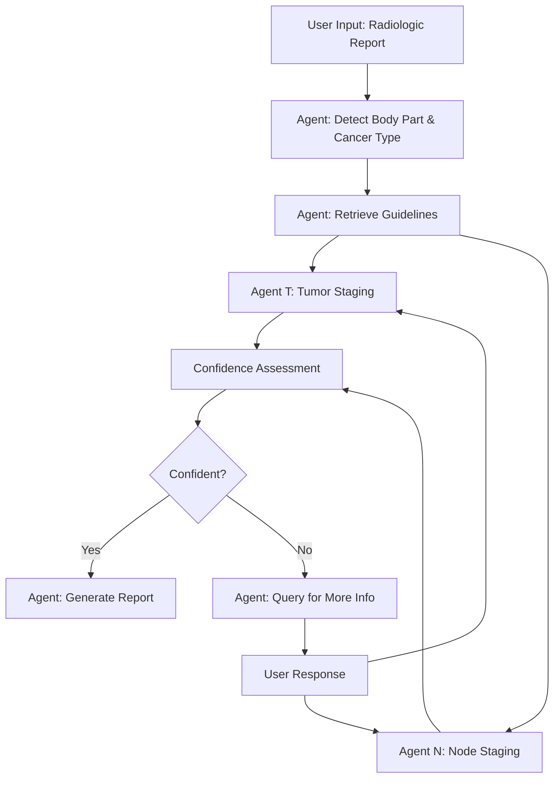

# Radiologic TN Staging System

**GitHub Repository**: https://github.com/znee/tn_staging_agentic

## Project Overview

An automated TN staging analysis system for radiologic reports that helps radiologists produce high-quality, standardized reports using a step-wise, agentic approach.

### Key Features
- **Automated staging analysis** from radiologic reports
- **Step-wise processing** for reproducibility and accuracy
- **Dual implementation**: OpenAI (cloud) and Ollama (local/privacy-focused)
- **Guideline-based** staging with PDF tokenization support

## System Architecture

### Core Workflow



### Agent Descriptions

1. **`agent_detect`**
   - Input: `context_R` (radiologic report)
   - Output: `context_B` (body part and cancer type)
   - Purpose: Identifies the anatomical location and cancer type from the report

2. **`agent_retrieve_guideline`**
   - Input: `context_B`
   - Output: `context_GT` (T staging guidelines), `context_GN` (N staging guidelines)
   - Purpose: Retrieves relevant staging criteria from tokenized PDF guidelines
   - Note: Must handle various staging systems (e.g., T1-T4 vs T1-T4a/b)

3. **`agent_T`** and **`agent_N`** (Parallel execution)
   - Input: `context_R` (raw report), `context_B` (body part/cancer type), `context_GT`/`context_GN` (guidelines)
   - Output: `context_T`/`context_N` (staging results), `context_CT`/`context_CN` (confidence), `context_RationaleT`/`context_RationaleN` (rationale)
   - Purpose: **Directly analyze raw report with guidelines** to determine staging
   - Method: **LLM-based analysis with structured JSON output** including extracted information
   - Fallback: Returns TX/NX if staging cannot be determined

4. **`agent_query`**
   - Input: All contexts when confidence is low or output from `agent_T` or `agent_N` are TX/NX
   - Output: `context_Q` (specific questions for user)
   - Purpose: Generates targeted questions to obtain missing information

5. **`agent_report`**
   - Input: All available contexts
   - Output: Formal radiologic report with comprehensive staging
   - Purpose: Produces the final structured report

## Implementation Details

### Context Variables
- `context_R`: Original radiologic report
- `context_B`: Body part and cancer type information
- `context_GT`: T staging guidelines
- `context_GN`: N staging guidelines
- `context_T`: T staging result
- `context_N`: N staging result
- `context_CT`: Confidence level of T staging
- `context_CN`: Confidence level of N staging
- `context_RationaleT`: Reasoning for T staging decisions
- `context_RationaleN`: Reasoning for N staging decisions
- `context_Q`: Query for additional information
- `context_RR`: User response to query

### Key Development Principles

1. **LLM-First Architecture**
   - **No hardcoded medical rules** - all staging logic through LLM + guidelines
   - **Direct report analysis** - no intermediate pattern extraction layer
   - **Structured JSON output** with staging, confidence, rationale, and extracted info
   - **Guidelines-based reasoning** - always reference retrieved AJCC criteria

2. **Error Handling**
   - Handle incomplete or ambiguous reports gracefully
   - Fallback to TX/NX when LLM analysis fails (not when medical criteria unclear)
   - Robust JSON parsing with text extraction fallbacks
   - Clear error messages for debugging

3. **Testing Strategy**
   - Unit tests for each agent with various report formats
   - Integration tests for the full workflow including query handling
   - Test cases for edge cases (missing information, ambiguous descriptions)
   - Validation of JSON output format consistency

4. **Performance Considerations**
   - Parallel execution of T and N staging agents
   - Efficient PDF tokenization and retrieval
   - Structured prompting to minimize LLM response time

5. **User Experience**
   - **Interactive workflow** - pause for user input when confidence low
   - Clear, specific questions when additional information is needed
   - Transparent rationale citing specific guideline criteria
   - Professional report formatting with extracted information display

## Technical Requirements

### Dependencies
- **OpenAI Version**: OpenAI API, langchain, pdf parsing libraries
- **Ollama Version**: Ollama, local LLM models, same parsing libraries
- **Common**: PDF tokenization, vector storage for guideline retrieval

### Directory Structure
```
radiologic-tn-staging/
├── agents/
│   ├── base.py
│   ├── detect.py
│   ├── retrieve_guideline.py
│   ├── staging_t.py
│   ├── staging_n.py
│   ├── query.py
│   └── report.py
├── contexts/
│   └── context_manager.py
├── utils/
│   └── language_validation.py
├── docs/
│   └── language_validation.md
├── guidelines/
│   ├── tokenizer.py
│   └── pdfs/
├── tests/
│   ├── unit/
│   └── integration/
├── config/
│   ├── openai_config.py
│   └── ollama_config.py
├── rebuild_vector_store.py
├── tn_staging_gui.py
└── main.py
```

## Getting Started

### Setup and Installation

```bash
# Install Python dependencies
pip install -r requirements.txt

# Or use conda environment (RECOMMENDED)
conda env create -f environment.yml
conda activate tnm-staging

# Conda environment details:
# - Location: /opt/homebrew/Caskroom/miniconda/base/envs/tnm-staging
# - Python: 3.10.17
# - All dependencies pre-installed including PyMuPDF for PDF processing

# For Ollama version - pull required models
ollama pull qwen3:8b
ollama pull nomic-embed-text
ollama pull llama3.2:latest
```

# Run with OpenAI
python main.py --backend openai --report "path/to/report.txt"

# Run with Ollama
python main.py --backend ollama --report "path/to/report.txt"
```

### Building Vector Stores (Required before first use)

```bash
# RECOMMENDED: Advanced tokenizer with PyMuPDF table extraction (84.6% TN_Staging_Agentic compliant)
python rebuild_vector_store.py  # Uses Ollama embeddings

# Alternative: Core library tokenizer (100% compliant but generic)
python -c "from guidelines.tokenizer import rebuild_vector_store; rebuild_vector_store()"

# Basic UI options (50% compliance, moved to not_using/)
streamlit run not_using/ajcc_tokenizer_ollama.py   # Basic Streamlit UI
streamlit run not_using/ajcc_tokenizer_openai.py  # Basic Streamlit UI
```

**Advanced Tokenizer Features** (`rebuild_vector_store.py`):
- **PyMuPDF table extraction**: `find_tables()` method for accurate table detection
- **Medical table preservation**: `[MEDICAL TABLE]` and `[END TABLE]` markers
- **Exact configuration**: 1000 chunk size, 200 overlap (matches production stores)
- **Page-level processing**: Preserves document structure with page markers
- **Current PDF results**: Produces 34 chunks from `Oralcavity_oropharyngeal.pdf` (6 pages, 4 medical tables detected)

**Streamlit App Features**:
- User-friendly web interface
- File upload and configuration options
- Basic table detection patterns
- Progress tracking and visualization


### Configuration
1. Set up API keys (OpenAI version)
2. Configure Ollama models (Ollama version)
3. Load and tokenize guideline PDFs
4. Configure confidence thresholds

## Development Notes

### Current Focus
- [x] Implement base agent framework
- [x] PDF tokenization and retrieval system
- [x] T and N staging logic with confidence assessment
- [x] Query generation for missing information
- [x] Report generation with proper formatting
- [x] Language validation system for English-only outputs
- [x] Complete final report display in GUI

### Next Phase
- [ ] Update report format with new user-provided prompt (pending user input)

### Future Enhancements
- Web interface for easier interaction
- Batch processing capabilities
- Integration with hospital systems
- Multi-language support
- Continuous learning from feedback

## Recent Fixes and Improvements

### 🔧 Language Validation System (2025-06-25)
- **Issue**: LLM outputs occasionally contained mixed English-Chinese text (e.g., "upper颈内淋巴结")
- **Solution**: Created global `utils/language_validation.py` with reusable validation functions
- **Features**:
  - Unicode pattern detection for non-Latin characters
  - Medical term replacement dictionary (Chinese → English)
  - Automatic fallback for mixed-language outputs
  - Global enable/disable configuration
- **Implementation**: Enhanced prompt templates with explicit English-only requirements

### 📄 Final Report Display Fix (2025-06-25)
- **Issue**: Complete staging reports were generated but not displayed in GUI
- **Root Cause**: `ContextManager.get_summary()` method missing `final_report` field
- **Solution**: Added `final_report` to context summary and GUI display
- **Result**: GUI now shows expandable "📄 Complete Staging Report" section with:
  - Executive Summary with TNM staging and clinical significance
  - Detailed Staging Analysis with rationale and confidence
  - Clinical Recommendations for next steps
  - Technical Notes with disclaimers

### 🏗️ System Architecture Validation
- **Verified**: All agents follow LLM-first architecture without hardcoded medical rules
- **Confirmed**: Guideline-based staging using semantic retrieval from AJCC PDFs
- **Validated**: Agentic routing with smart question generation for missing information

## Contributing

When working on this project:
1. Follow the agent-based architecture
2. Ensure all agents have clear input/output contracts
3. Write comprehensive tests for new functionality
4. Document any changes to the staging logic
5. Keep the dual-backend compatibility in mind
6. Use the language validation utilities for all LLM outputs
7. Test final report generation and display in GUI